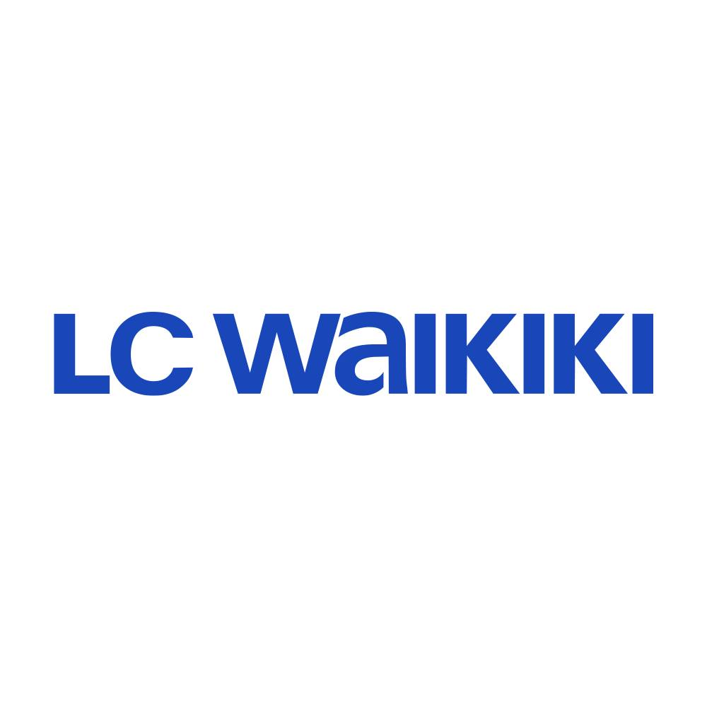
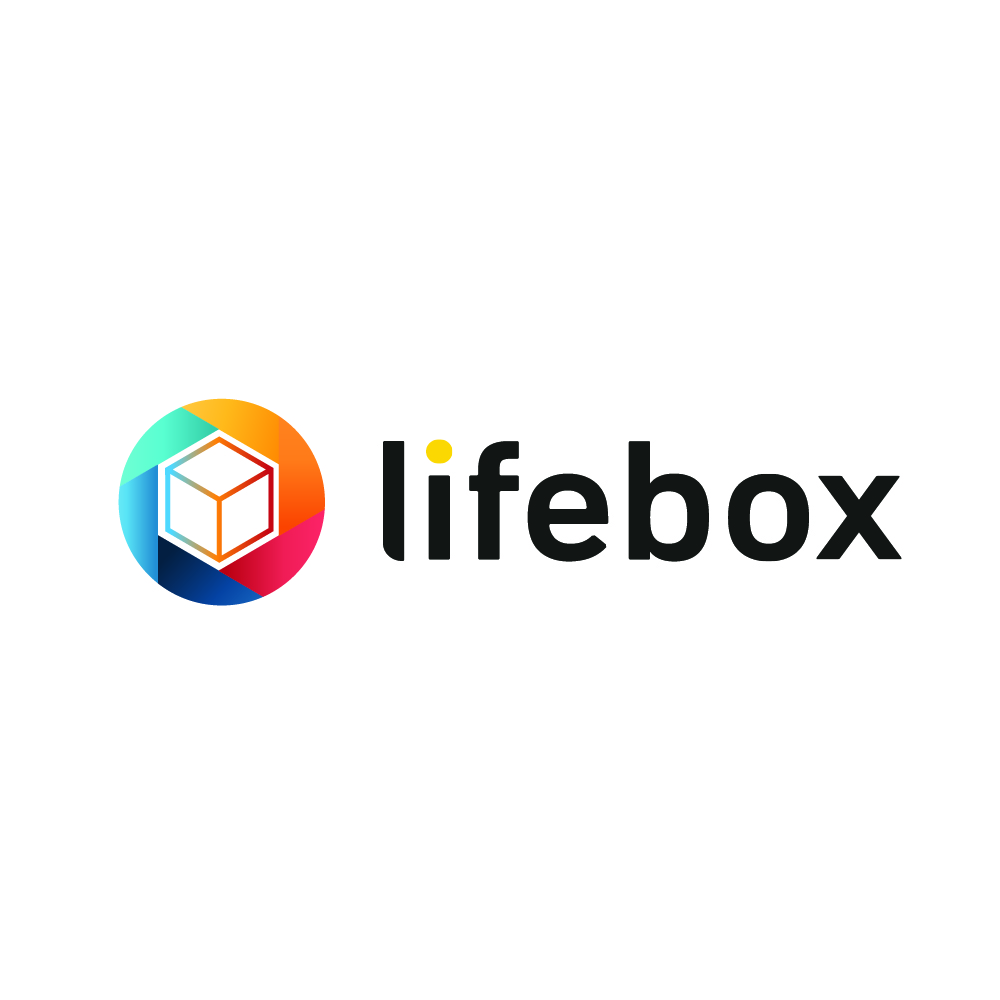
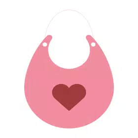

 

  

    ENGINEERED FOR SCALE

<table border="0" width="100%" style="border-collapse: collapse;">
    <tr>
        <td width="33%" align="center" style="border: none; padding-bottom: 30px;">
            <a href="https://play.google.com/store/apps/details?id=com.lcwaikiki.android&hl=en">
                
                  
                <b style="font-size: 14px; color: #ffffff;">LC Waikiki</b>
                 
                <small style="color: #3DDC84;">10M+ Downloads</small>
            </a>
        </td>
        <td width="33%" align="center" style="border: none; padding-bottom: 30px;">
            <a href="https://play.google.com/store/apps/details?id=tr.com.turkcell.akillidepo&hl=en">
                
                  
                <b style="font-size: 14px; color: #ffffff;">Lifebox</b>
                 
                <small style="color: #3DDC84;">10M+ Downloads</small>
            </a>
        </td>
        <td width="33%" align="center" style="border: none; padding-bottom: 30px;">
            <a href="https://play.google.com/store/apps/details?id=com.solidict.catalog4p">
                
                  
                <b style="font-size: 14px; color: #ffffff;">Gift Bank</b>
                 
                <small style="color: #3DDC84;">1M+ Downloads</small>
            </a>
        </td>
    </tr>
    <tr>
        <td width="33%" align="center" style="border: none;">
            <a href="https://play.google.com/store/apps/details?id=com.tuttur.tuttur_mobile_android&hl=en"> 
                
                  
                <b style="font-size: 14px; color: #ffffff;">Tuttur</b>
                 
                <small style="color: #8b949e;">100K+ Downloads</small>
            </a>
        </td>
        <td width="33%" align="center" style="border: none;">
            <a href="https://play.google.com/store/apps/details?id=momsco.molfix.anne.bebek&gl=US">
                
                  
                <b style="font-size: 14px; color: #ffffff;">Momsco</b>
                 
                <small style="color: #8b949e;">100K+ Downloads</small>
            </a>
        </td>
        <td width="33%" align="center" style="border: none;">
            <a href="https://apkpure.com/bubu-lite/com.yuptechnology.bubulite">
                
                  
                <b style="font-size: 14px; color: #ffffff;">Bubu Lite</b>
                 
                <small style="color: #8b949e;">High Growth</small>
            </a>
        </td>
    </tr>
</table>

  

&nbsp;

